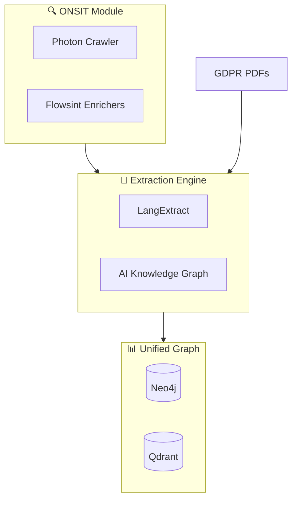
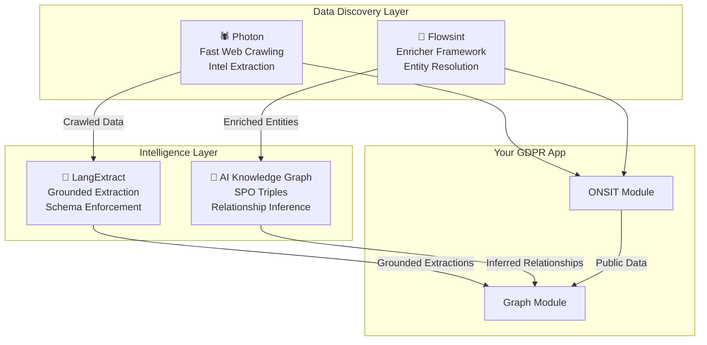
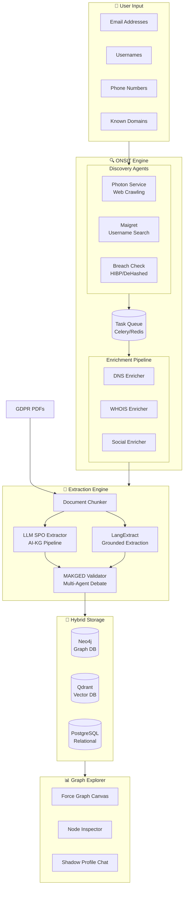
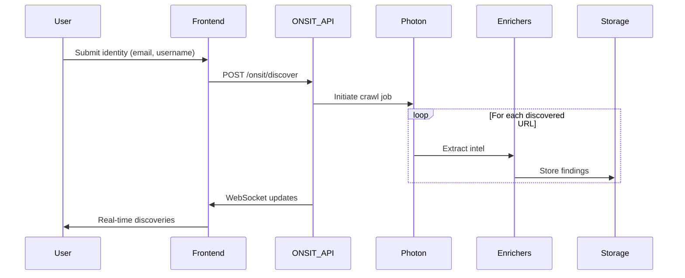
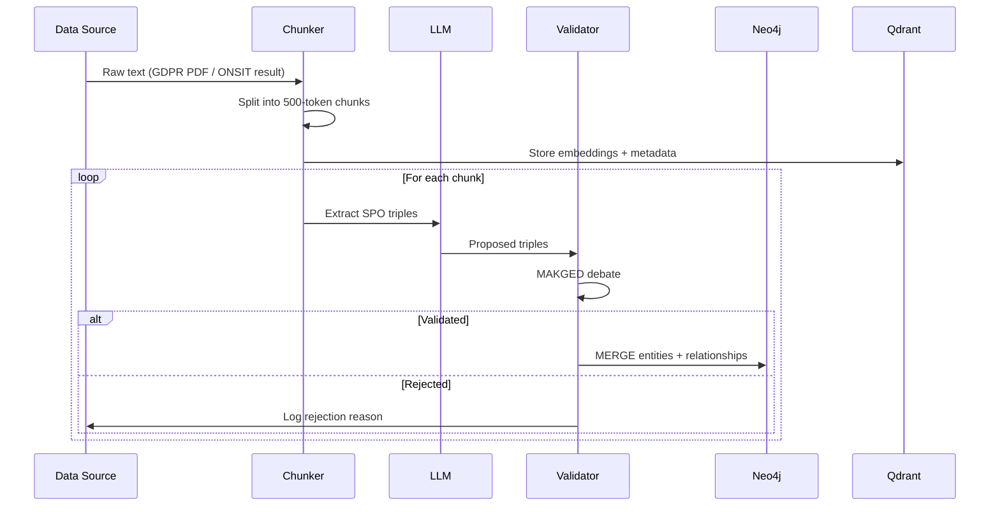
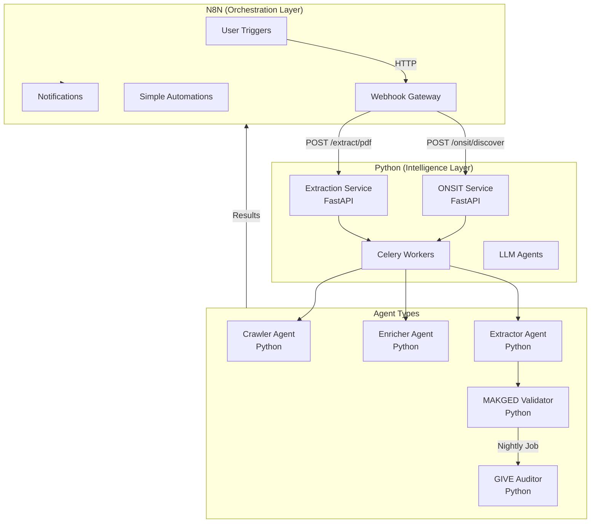

# ONSIT & Graph Integration Plan

> **Document Purpose:** Comprehensive analysis of external codebases and detailed integration strategy for enhancing the GDPR App's ONSIT (public information discovery) and Graph (unified data aggregation) features.

---

## Table of Contents

1. [Executive Summary](#1-executive-summary)
2. [Codebase Summaries](#2-codebase-summaries)
   - [Flowsint](#21-flowsint)
   - [Photon](#22-photon)
   - [AI Knowledge Graph](#23-ai-knowledge-graph)
   - [LangExtract](#24-langextract)
3. [Synergy Map](#3-synergy-map)
4. [Integration Architecture](#4-integration-architecture)
5. [Detailed Implementation Plan](#5-detailed-implementation-plan)
6. [Verification Strategy](#6-verification-strategy)

---

## 1. Executive Summary

The GDPR App requires two enhanced features:

- **ONSIT Module**: Active reconnaissance to discover all public information about the user on the web
- **Graph Module**: Aggregation layer combining ONSIT-discovered data with GDPR request data into a unified knowledge graph

This document proposes integrating concepts and techniques from four open-source projects to create a powerful, privacy-focused personal data intelligence system.



---

## 2. Codebase Summaries

### 2.1 Flowsint

| Attribute | Details |
|-----------|---------|
| **Repository** | [github.com/reconurge/flowsint](https://github.com/reconurge/flowsint) |
| **Purpose** | Visual, graph-based OSINT investigation platform |
| **Tech Stack** | Python (FastAPI backend), Neo4j + PostgreSQL, React frontend, Celery tasks |
| **License** | Open Source |

#### Core Architecture

```
flowsint-app (frontend)
       ↓
flowsint-api (FastAPI server)
       ↓
flowsint-core (orchestrator, tasks, vault)
       ↓
flowsint-enrichers (enrichers & tools)
       ↓
flowsint-types (Pydantic models)
```

#### Key Features

- **Modular Enricher System**: Pluggable enrichers for different data types
- **Graph Visualization**: React Force Graph for interactive exploration
- **N8N Integration**: Built-in connector for workflow automation

#### Enricher Categories (Relevant to ONSIT)

| Category | Enrichers | Relevance |
|----------|-----------|-----------|
| **Domain** | Reverse DNS, Subdomain Discovery, WHOIS, Domain History | Find sites user is registered on |
| **Social Media** | Maigret (username search across platforms) | Discover public profiles |
| **Email** | Gravatar lookup, Breach databases, Email to Domains | Map email to services |
| **Organization** | Org to ASN, Org to Domains | Discover corporate data holders |
| **Website** | Crawler, Link extraction, Webtracker detection | Passive reconnaissance |
| **Individual** | Individual to Organization, Individual to Domains | Personal data mapping |

#### Code Patterns to Adopt

```python
# Enricher base class pattern from Flowsint
class BaseEnricher:
    input_type: EntityType
    output_type: EntityType
    
    async def enrich(self, entity: Entity) -> list[Entity]:
        """Transform input entity into discovered entities"""
        pass
```

---

### 2.2 Photon

| Attribute | Details |
|-----------|---------|
| **Repository** | [github.com/s0md3v/Photon](https://github.com/s0md3v/Photon) |
| **Purpose** | Incredibly fast web crawler designed for OSINT |
| **Tech Stack** | Python, Multi-threaded, Concurrent processing |
| **License** | GPL v3.0 |

#### Key Features

##### Data Extraction Capabilities

| Type | Examples |
|------|----------|
| **URLs** | In-scope, out-of-scope, parametrized |
| **Intel** | Emails, social media accounts, Amazon S3 buckets |
| **Files** | PDFs, images, XML, documents |
| **Secrets** | API keys, auth tokens, hashes |
| **JavaScript** | JS files and their endpoints |
| **Custom Regex** | User-defined pattern matching |
| **DNS** | Subdomains and DNS data |

##### Performance Features

- **Smart Thread Management**: Optimized concurrent crawling
- **Wayback Machine Integration**: Uses `archive.org` as seed source
- **DNSDumpster Plugin**: Enhanced DNS intelligence
- **Docker Support**: Lightweight Python-Alpine container

#### Integration Value for ONSIT

```python
# Photon crawl output structure
{
    "internal_urls": [...],      # Same-domain links
    "external_urls": [...],      # External references
    "emails": [...],             # Discovered email addresses
    "files": [...],              # Document/media URLs
    "intel": {
        "social_media": [...],   # Platform profiles
        "api_keys": [...],       # Leaked credentials
    }
}
```

#### Relevant Code Patterns

```python
# From Photon's core.py - multi-threaded crawling
def crawl(url):
    create_thread_pool()
    process_seeds(url)
    extract_intel()
    export_results(format='json')
```

---

### 2.3 AI Knowledge Graph

| Attribute | Details |
|-----------|---------|
| **Repository** | [github.com/robert-mcdermott/ai-knowledge-graph](https://github.com/robert-mcdermott/ai-knowledge-graph) |
| **Purpose** | LLM-powered knowledge extraction from unstructured text |
| **Tech Stack** | Python, Any OpenAI-compatible API, PyVis visualization |
| **License** | Open Source |

#### Processing Pipeline

```mermaid
flowchart LR
    subgraph Phase1["Phase 1: Extraction"]
        A[Document] --> B[Chunk Text]
        B --> C[LLM Extract SPO Triples]
    end
    
    subgraph Phase2["Phase 2: Standardization"]
        C --> D[Normalize Entities]
        D --> E[LLM Entity Resolution]
    end
    
    subgraph Phase3["Phase 3: Inference"]
        E --> F[Community Detection]
        F --> G[Infer Relationships]
        G --> H[Transitive Closure]
    end
    
    subgraph Phase4["Phase 4: Visualization"]
        H --> I[Centrality Metrics]
        I --> J[Interactive HTML Graph]
    end
```



#### Key Concepts

##### Subject-Predicate-Object (SPO) Triple Extraction

```json
{
  "subject": "Google",
  "predicate": "COLLECTS",
  "object": "Location History"
}
```

##### Entity Standardization

Resolves variations like:

- "AI", "artificial intelligence", "AI system" → **"Artificial Intelligence"**
- "<j.doe@email.com>", "John Doe email" → **"<john.doe@email.com>"**

##### Relationship Inference

- **Transitive Inference**: If A→B and B→C, infer A→C
- **Community Detection**: Louvain algorithm for clustering
- **Lexical Similarity**: Semantic relationship discovery
- **Cross-Community Linking**: Connect isolated graph islands

#### Configuration Pattern

```toml
[llm]
model = "gemma3"
base_url = "http://localhost:11434/v1/chat/completions"

[chunking]
chunk_size = 200
overlap = 20

[standardization]
enabled = true
use_llm_for_entities = true

[inference]
enabled = true
apply_transitive = true
```

---

### 2.4 LangExtract

| Attribute | Details |
|-----------|---------|
| **Repository** | [github.com/google/langextract](https://github.com/google/langextract) |
| **Purpose** | Structured extraction from unstructured text with source grounding |
| **Tech Stack** | Python, Gemini/OpenAI/Ollama, Interactive HTML visualization |
| **License** | Apache 2.0 |

#### Unique Value Proposition

| Feature | Description |
|---------|-------------|
| **Precise Source Grounding** | Maps every extraction to exact text location |
| **Reliable Structured Outputs** | Schema enforcement via controlled generation |
| **Long Document Optimization** | Chunking + parallel processing + multi-pass |
| **Interactive Visualization** | Self-contained HTML for review |
| **Flexible LLM Support** | Cloud and local model support |
| **Domain Adaptable** | Few-shot examples define task |

#### Code Pattern - Extraction Task Definition

```python
import langextract as lx

# Define extraction task with few-shot examples
examples = [
    lx.data.ExampleData(
        text="Google collects your browsing history...",
        extractions=[
            lx.data.Extraction(
                extraction_class="data_collection",
                extraction_text="browsing history",
                attributes={"collector": "Google", "risk": "high"}
            )
        ]
    )
]

result = lx.extract(
    text_or_documents=gdpr_pdf_text,
    prompt_description="Extract personal data mentions...",
    examples=examples,
    model_id="gemini-2.5-flash",
    extraction_passes=3,
    max_workers=20
)
```

#### Visualization Output

- Generates interactive HTML with highlighted source text
- Supports thousands of entities
- Clickable extraction → source navigation

---

## 3. Synergy Map

How these codebases complement each other for ONSIT and Graph:



| Project | ONSIT Contribution | Graph Contribution |
|---------|-------------------|-------------------|
| **Photon** | Web crawling, URL extraction, secret detection | Initial data source |
| **Flowsint** | Enricher architecture, entity types, N8N integration | Graph exploration UI patterns |
| **AI KG** | - | SPO extraction, entity standardization, inference |
| **LangExtract** | - | Grounded extraction, structured outputs |

---

## 4. Integration Architecture

### 4.1 High-Level Architecture



### 4.2 Component Mapping

| Component | Source Project | Technology | Purpose |
|-----------|---------------|------------|---------|
| `onsit-crawler` | Photon | Python service | Web crawling and intel extraction |
| `onsit-enrichers` | Flowsint | Python modules | Entity enrichment pipeline |
| `extraction-spo` | AI-KG | Python | Triple extraction from text |
| `extraction-grounded` | LangExtract | Python | Schema-enforced extraction |
| `graph-inference` | AI-KG | Python | Relationship inference engine |
| `graph-validator` | Custom (MAKGED) | Python | Multi-agent validation |

### 4.3 Data Flow Diagrams

#### ONSIT Discovery Flow



#### Graph Ingestion Flow



---

## 5. Detailed Implementation Plan

### Phase 1: Infrastructure Setup

#### 1.1 Docker Services Extension

Add to `docker-compose.yml`:

```yaml
services:
  # ... existing services ...
  
  redis:
    image: redis:7-alpine
    ports:
      - "6379:6379"
    networks:
      - gdpr-net

  celery-worker:
    build: ./onsit
    command: celery -A tasks worker -l INFO
    depends_on:
      - redis
    environment:
      - REDIS_URL=redis://redis:6379/0
    networks:
      - gdpr-net

  photon:
    build: ./onsit/photon
    volumes:
      - ./data/crawls:/app/output
    networks:
      - gdpr-net
```

#### 1.2 New Directory Structure

```
1GDPRAGENT/
├── onsit/                          # [NEW] ONSIT Python service
│   ├── Dockerfile
│   ├── requirements.txt
│   ├── tasks.py                    # Celery task definitions
│   ├── crawler/                    # Adapted from Photon
│   │   ├── __init__.py
│   │   ├── core.py
│   │   └── extractors.py
│   ├── enrichers/                  # Adapted from Flowsint
│   │   ├── __init__.py
│   │   ├── base.py
│   │   ├── dns.py
│   │   ├── social.py
│   │   ├── email.py
│   │   └── breach.py
│   └── api/
│       ├── __init__.py
│       └── routes.py               # FastAPI endpoints
│
├── extraction/                     # [NEW] Extraction engine
│   ├── Dockerfile
│   ├── requirements.txt
│   ├── spo_extractor.py           # From ai-knowledge-graph
│   ├── grounded_extractor.py      # From langextract
│   ├── entity_resolver.py
│   ├── inference_engine.py
│   └── validators/
│       ├── __init__.py
│       └── makged.py              # Multi-agent validation
│
├── frontend/
│   ├── app/
│   │   ├── dashboard/
│   │   │   ├── graph/             # [NEW] Graph explorer
│   │   │   │   └── page.tsx
│   │   │   └── onsit/             # [NEW] ONSIT dashboard
│   │   │       └── page.tsx
│   │   └── api/
│   │       ├── onsit/             # [NEW] ONSIT API routes
│   │       │   └── route.ts
│   │       └── graph/             # [NEW] Graph API routes
│   │           └── route.ts
│   ├── components/
│   │   ├── graph/                 # [NEW] Graph components
│   │   │   ├── GraphCanvas.tsx
│   │   │   ├── NodeInspector.tsx
│   │   │   └── ShadowChat.tsx
│   │   └── onsit/                 # [NEW] ONSIT components
│   │       ├── DiscoveryForm.tsx
│   │       └── FindingsList.tsx
│   └── lib/
│       ├── neo4j.ts               # [NEW] Neo4j driver
│       └── qdrant.ts              # [NEW] Qdrant client
```

---

### Phase 2: ONSIT Engine Implementation

#### 2.1 Core Crawler (Adapted from Photon)

**File:** `onsit/crawler/core.py`

Key adaptations:

- Integrate with Celery for async processing
- Output to PostgreSQL + Neo4j instead of files
- Add rate limiting and respect robots.txt
- Privacy-focused: Only crawl user-authorized targets

```python
# Pseudo-code structure
class ONSITCrawler:
    def __init__(self, target_identity: dict):
        self.email = target_identity.get("email")
        self.usernames = target_identity.get("usernames", [])
        self.domains = target_identity.get("known_domains", [])
    
    async def discover(self) -> CrawlResult:
        """Main discovery pipeline"""
        results = []
        
        # Stage 1: Username enumeration (Maigret-style)
        for username in self.usernames:
            results.extend(await self.check_username(username))
        
        # Stage 2: Email breach check
        results.extend(await self.check_breaches(self.email))
        
        # Stage 3: Domain crawling (Photon-style)
        for domain in self.domains:
            results.extend(await self.crawl_domain(domain))
        
        return results
```

#### 2.2 Enricher Framework (Adapted from Flowsint)

**File:** `onsit/enrichers/base.py`

```python
from abc import ABC, abstractmethod
from typing import List
from pydantic import BaseModel

class Entity(BaseModel):
    id: str
    type: str  # email, username, phone, domain, ip, account
    value: str
    metadata: dict = {}
    source: str  # Where this was discovered

class BaseEnricher(ABC):
    input_type: str
    output_types: List[str]
    
    @abstractmethod
    async def enrich(self, entity: Entity) -> List[Entity]:
        pass
```

**Available Enrichers to Implement:**

| Enricher | Input | Outputs | Data Source |
|----------|-------|---------|-------------|
| `EmailBreachEnricher` | email | breach_records | HIBP API |
| `UsernameEnricher` | username | social_profiles | Maigret patterns |
| `DomainEnricher` | domain | emails, subdomains | DNS + Crawler |
| `WHOISEnricher` | domain | registration_info | WHOIS lookup |
| `GravatarEnricher` | email | profile_image, name | Gravatar API |

---

### Phase 3: Extraction Engine Implementation

#### 3.1 SPO Triple Extractor (Adapted from ai-knowledge-graph)

**File:** `extraction/spo_extractor.py`

Key features:

- Chunk text into overlapping segments
- LLM-based triple extraction
- Entity standardization pass
- Relationship inference

```python
class SPOExtractor:
    def __init__(self, llm_config: dict):
        self.model = llm_config["model"]
        self.chunk_size = 200
        self.overlap = 20
    
    def extract_triples(self, text: str) -> List[Triple]:
        chunks = self.chunk_text(text)
        raw_triples = []
        
        for chunk in chunks:
            triples = self.llm_extract(chunk)
            raw_triples.extend(triples)
        
        # Standardize entities
        standardized = self.standardize_entities(raw_triples)
        
        # Infer additional relationships
        with_inferences = self.infer_relationships(standardized)
        
        return with_inferences
```

#### 3.2 Grounded Extractor (Adapted from LangExtract)

**File:** `extraction/grounded_extractor.py`

Key features:

- Schema-enforced extraction
- Source text grounding (traceability)
- Multi-pass for higher recall
- Interactive visualization export

```python
import langextract as lx

class GroundedExtractor:
    EXTRACTION_SCHEMA = [
        {"class": "data_collection", "attributes": ["collector", "category", "risk_level"]},
        {"class": "shared_attribute", "attributes": ["type", "value"]},
        {"class": "inference", "attributes": ["prediction", "confidence"]}
    ]
    
    def extract(self, text: str, source_file: str) -> List[GroundedExtraction]:
        examples = self.load_domain_examples()
        
        result = lx.extract(
            text_or_documents=text,
            prompt_description=self.build_prompt(),
            examples=examples,
            model_id="gemini-2.5-flash",
            extraction_passes=3
        )
        
        return self.process_results(result, source_file)
```

#### 3.3 MAKGED Validator

**File:** `extraction/validators/makged.py`

Implements multi-agent debate for hallucination prevention:

```python
class MAKGEDValidator:
    """
    Multi-Agent Knowledge Graph Error Detection
    
    Two agents debate proposed triples:
    - Forward Agent: Argues FOR the triple based on source text
    - Backward Agent: Argues AGAINST, checking context validity
    """
    
    async def validate(self, triple: Triple, source_context: str) -> ValidationResult:
        forward_argument = await self.forward_agent.argue(triple, source_context)
        backward_argument = await self.backward_agent.challenge(triple, source_context, forward_argument)
        
        # Two rounds of debate
        for _ in range(2):
            forward_argument = await self.forward_agent.rebut(backward_argument)
            backward_argument = await self.backward_agent.rebut(forward_argument)
        
        # Final verdict
        if forward_argument.confidence > backward_argument.confidence:
            return ValidationResult(valid=True, confidence=forward_argument.confidence)
        else:
            return ValidationResult(valid=False, reason=backward_argument.reason)
```

---

### Phase 4: Graph Integration

#### 4.1 Neo4j Schema Extension

**File:** `02_DATABASE_SCHEMA_GRAPH.cypher`

```cypher
// ONSIT-specific node labels
CREATE CONSTRAINT onsit_finding_id IF NOT EXISTS
FOR (f:ONSITFinding) REQUIRE f.id IS UNIQUE;

// New node types for ONSIT discoveries
// (:ONSITFinding) - Raw discovery from web crawl
// (:SocialProfile) - Discovered social media account
// (:BreachRecord) - Data breach appearance
// (:PublicDocument) - Publicly available document

// Relationships
// (u:User)-[:DISCOVERED_VIA_ONSIT]->(f:ONSITFinding)
// (f:ONSITFinding)-[:LINKS_TO]->(a:Attribute)
// (f:ONSITFinding)-[:CONFIRMED_BY]->(e:Evidence)
```

#### 4.2 Frontend Graph Explorer

**File:** `frontend/app/dashboard/graph/page.tsx`

Key components:

- `GraphCanvas`: Interactive force-directed graph (react-force-graph-2d)
- `NodeInspector`: Detail panel for selected nodes
- `ShadowChat`: Natural language query interface

```typescript
// Component structure
export default function GraphPage() {
  return (
    <div className="grid grid-cols-[1fr_380px]">
      <GraphCanvas 
        onNodeClick={setSelectedNode}
        highlightONSIT={showONSIT}
        highlightGDPR={showGDPR}
      />
      <aside>
        <NodeInspector node={selectedNode} />
        <ShadowChat onQuery={handleQuery} />
      </aside>
    </div>
  )
}
```

#### 4.3 ONSIT Dashboard

**File:** `frontend/app/dashboard/onsit/page.tsx`

Features:

- Identity input form (email, usernames, phone)
- Real-time discovery progress
- Findings list with risk assessment
- "Add to Graph" action for confirmed findings

---

### Phase 5: API Integration

#### 5.1 ONSIT API Routes

**File:** `frontend/app/api/onsit/discover/route.ts`

```typescript
export async function POST(req: Request) {
  const { email, usernames, phone } = await req.json()
  
  // Trigger Celery task
  const taskId = await triggerONSITDiscovery({ email, usernames, phone })
  
  return Response.json({ taskId, status: "processing" })
}
```

**File:** `frontend/app/api/onsit/status/[taskId]/route.ts`

```typescript
export async function GET(req: Request, { params }) {
  const status = await getTaskStatus(params.taskId)
  return Response.json(status)
}
```

#### 5.2 Graph API Routes

**File:** `frontend/app/api/graph/data/route.ts`

```typescript
export async function GET(req: Request) {
  const { searchParams } = new URL(req.url)
  const filter = searchParams.get("filter") // "all" | "onsit" | "gdpr"
  
  const driver = await getNeo4jDriver()
  const session = driver.session()
  
  const result = await session.run(`
    MATCH (n)-[r]->(m)
    WHERE $filter = 'all' OR n.source = $filter
    RETURN n, r, m
  `, { filter })
  
  return Response.json(formatForForceGraph(result))
}
```

---

## 6. Verification Strategy

### 6.1 Unit Tests

| Component | Test File | Description |
|-----------|-----------|-------------|
| Crawler | `tests/test_crawler.py` | Mock crawl with sample HTML |
| Enrichers | `tests/test_enrichers.py` | Mock API responses |
| SPO Extractor | `tests/test_spo.py` | Known input → expected triples |
| Validator | `tests/test_makged.py` | Hallucination detection scenarios |

### 6.2 Integration Tests

| Test | Command | Validation |
|------|---------|------------|
| Neo4j connection | `pytest tests/integration/test_neo4j.py` | Verify CRUD operations |
| ONSIT pipeline | `pytest tests/integration/test_onsit_pipeline.py` | End-to-end discovery |
| Graph ingestion | `pytest tests/integration/test_ingestion.py` | PDF → Graph nodes |

### 6.3 Manual Verification

#### ONSIT Module

1. **Start services:** `docker-compose up -d`
2. **Navigate to:** `http://localhost:3000/dashboard/onsit`
3. **Input test identity:**
   - Email: `test@example.com`
   - Username: `testuser123`
4. **Expected:** Discovery progress shown, findings appear in list
5. **Verify Graph:** Click "View in Graph" → See `ONSITFinding` nodes

#### Graph Module

1. **Upload test GDPR PDF:** Via existing request flow
2. **Navigate to:** `http://localhost:3000/dashboard/graph`
3. **Verify:**
   - Nodes appear from PDF extraction
   - ONSIT findings (if any) linked by shared attributes
   - Click node → Inspector shows properties and source evidence
4. **Test Shadow Chat:**
   - Query: "Who has my email?"
   - Expected: List of companies with email connections

---

## Appendix A: Dependencies

### Python (onsit/requirements.txt)

```
fastapi==0.109.0
celery[redis]==5.3.6
requests==2.31.0
beautifulsoup4==4.12.3
maigret==0.4.4
neo4j==5.16.0
qdrant-client==1.7.0
langextract>=0.2.0
pydantic==2.5.3
```

### Node.js (frontend/package.json additions)

```json
{
  "dependencies": {
    "neo4j-driver": "^5.17.0",
    "react-force-graph-2d": "^1.25.0",
    "@qdrant/js-client-rest": "^1.7.0"
  }
}
```

---

## Appendix B: Environment Variables

```env
# ONSIT Configuration
ONSIT_REDIS_URL=redis://redis:6379/0
ONSIT_RATE_LIMIT=10  # Requests per second

# Extraction Configuration
EXTRACTION_LLM_MODEL=gemma3
EXTRACTION_LLM_URL=http://ollama:11434/v1/chat/completions
EXTRACTION_CHUNK_SIZE=200

# Graph Configuration
NEO4J_URI=bolt://neo4j:7687
NEO4J_USER=neo4j
NEO4J_PASSWORD=your_secure_password

# Vector DB
QDRANT_URL=http://qdrant:6333
```

---

## 7. Complete Feature Extraction Catalog

> [!IMPORTANT]
> This section catalogs **ALL** features from the four source codebases to ensure nothing is missed during integration. Each feature is tagged with its source and adaptation notes.

### 7.1 Photon - Complete Feature List

#### Crawler Core Features

| Feature | Source File | Description | Adaptation Notes |
|---------|-------------|-------------|------------------|
| Multi-level recursive crawling | `photon.py` | Crawl to N levels deep from seed URL | Configure max depth per ONSIT scan |
| Thread pool management | `core/flash.py` | Concurrent request processing | Integrate with Celery for distributed crawling |
| robots.txt parsing | `core/zap.py` | Extract URLs from robots.txt | Respect or optionally bypass for self-scan |
| sitemap.xml extraction | `core/zap.py` | Parse XML sitemaps | Include in domain discovery |
| Wayback Machine seeds | `--wayback` flag | Fetch historical URLs from archive.org | Critical for finding deleted content about user |
| DNSDumpster integration | `plugins/dnsdumpster.py` | DNS intelligence and subdomain discovery | Map all subdomains user appears on |
| Custom User-Agent rotation | `core/requester.py` | Rotate through user agents | Avoid detection during self-scan |
| Proxy support | `core/utils.py` | HTTP/SOCKS5 proxy chains | Privacy during ONSIT discovery |
| Cookie injection | `--cookie` flag | Authenticated crawling | Crawl user's own accounts |
| Custom headers | `--headers` flag | Add custom HTTP headers | Authentication headers support |
| Timeout configuration | `--timeout` flag | Per-request timeout control | Prevent hanging on slow sites |
| Delay between requests | `--delay` flag | Rate limiting | Avoid IP bans |
| URL exclusion patterns | `--exclude` regex | Skip matching URLs | Filter out irrelevant pages |
| Website cloning | `core/mirror.py` | Local copy of discovered pages | Archive evidence locally |

#### Intel Detection Patterns (from `core/regex.py`)

| Pattern Name | Regex ID | What It Detects | ONSIT Use Case |
|--------------|----------|-----------------|----------------|
| `GENERIC_URL` | URL detection with defang handling | Standard and obfuscated URLs | Find all linked resources |
| `BRACKET_URL` | URL with `[.]` notation | Defanged URLs in security contexts | Forums, paste sites |
| `BACKSLASH_URL` | URL with `\.` notation | Another defang style | Technical documents |
| `HEXENCODED_URL` | Hex-encoded URLs | Obfuscated links | Malware reports about user |
| `URLENCODED_URL` | URL-encoded URLs | Double-encoded links | Web archives |
| `B64ENCODED_URL` | Base64-encoded URLs | Hidden links | Encoded references |
| `IPV4` | IPv4 addresses with defangs | IP addresses | Find user's exposed IPs |
| `IPV6` | IPv6 addresses | IPv6 addresses | Modern network exposure |
| `EMAIL` | Emails with defangs | Email addresses | All email variations |
| `MD5` | 32-char hex strings | MD5 hashes | Password breach indicators |
| `SHA1` | 40-char hex strings | SHA1 hashes | Breach data |
| `SHA256` | 64-char hex strings | SHA256 hashes | Modern breach data |
| `SHA512` | 128-char hex strings | SHA512 hashes | Secure hash leaks |
| `CREDIT_CARD` | 16-digit patterns | Credit card numbers (with Luhn check) | Financial exposure |
| `YARA_PARSE` | YARA rule patterns | Security research rules | User in threat reports |

#### Data Output Categories

| Category | Variable | Contents | Storage Target |
|----------|----------|----------|----------------|
| `internal` | URLs | Same-domain pages | PostgreSQL + crawl queue |
| `external` | URLs | External links | Neo4j relationships |
| `files` | URLs | Document/media files | Download queue |
| `intel` | Tuples | Email, social, credentials | Graph nodes |
| `scripts` | URLs | JavaScript files | Endpoint extraction |
| `endpoints` | Strings | API endpoints from JS | API mapping |
| `fuzzable` | URLs | URLs with parameters | Vulnerability notes |
| `keys` | Strings | High-entropy secrets | Security alerts |
| `robots` | URLs | From robots.txt | Site structure |
| `subdomains` | Domains | Discovered subdomains | Domain graph |
| `custom` | Strings | Custom regex matches | Flexible extraction |
| `failed` | URLs | Failed requests | Retry queue |

#### Plugins to Port

| Plugin | File | Functionality | Priority |
|--------|------|---------------|----------|
| `find_subdomains` | `plugins/find_subdomains.py` | Subdomain enumeration | HIGH |
| `dnsdumpster` | `plugins/dnsdumpster.py` | DNS map visualization | HIGH |
| `exporter` | `plugins/exporter.py` | CSV/JSON export | MEDIUM |

---

### 7.2 Flowsint - Complete Feature List

#### Entity Types (from flowsint-types)

| Entity Type | Properties | Graph Label | Use in ONSIT |
|-------------|------------|-------------|--------------|
| `Domain` | name, registrar, created_date | `:Domain` | Website ownership |
| `IP` | address, asn, geo_location | `:IP` | Network mapping |
| `ASN` | number, name, country | `:ASN` | Infrastructure tracking |
| `CIDR` | range, size | `:CIDR` | IP range analysis |
| `Email` | address, provider | `:Email` | Identity pivot |
| `Phone` | number, country_code | `:Phone` | Identity pivot |
| `Username` | value, platform | `:Username` | Social media tracking |
| `Individual` | name, aliases | `:Individual` | Person of interest |
| `Organization` | name, type | `:Organization` | Company tracking |
| `Website` | url, title, technologies | `:Website` | Web presence |
| `SocialProfile` | platform, url, username | `:SocialProfile` | Public profiles |
| `Credential` | type, value, source | `:Credential` | Exposed credentials |
| `CryptoWallet` | address, type | `:CryptoWallet` | Blockchain activity |
| `Transaction` | hash, amount, timestamp | `:Transaction` | Financial tracking |
| `NFT` | contract, token_id | `:NFT` | Digital asset ownership |

#### Enricher Catalog (ALL from flowsint-enrichers)

##### Domain Enrichers

| Enricher | Input → Output | API/Tool | Implementation Notes |
|----------|----------------|----------|---------------------|
| Reverse DNS | IP → Domains | DNS queries | Multiple domains per IP |
| DNS Resolution | Domain → IPs | DNS queries | A, AAAA, MX records |
| Subdomain Discovery | Domain → Subdomains | DNS brute + CT logs | Certificate transparency |
| WHOIS Lookup | Domain → Registration | WHOIS protocol | Owner, registrar, dates |
| Domain to Website | Domain → Website | HTTP probe | Technology fingerprinting |
| Domain to Root | Domain → Root Domain | TLD extraction | PSL-based extraction |
| Domain to ASN | Domain → ASN | IP → ASN lookup | Network ownership |
| Domain History | Domain → Historical | Wayback, SecurityTrails | Past DNS records |

##### IP Enrichers

| Enricher | Input → Output | API/Tool | Implementation Notes |
|----------|----------------|----------|---------------------|
| IP Information | IP → GeoIP data | MaxMind, ipinfo.io | Location, ISP, org |
| IP to ASN | IP → ASN | RIPE, BGP tables | Network ownership |
| IP Reputation | IP → Risk score | VirusTotal, AbuseIPDB | Threat intelligence |

##### ASN Enrichers

| Enricher | Input → Output | API/Tool | Implementation Notes |
|----------|----------------|----------|---------------------|
| ASN to CIDRs | ASN → IP ranges | RIPE, BGPView | All announced prefixes |
| ASN Info | ASN → Org details | RIPEstat | Ownership info |

##### CIDR Enrichers

| Enricher | Input → Output | API/Tool | Implementation Notes |
|----------|----------------|----------|---------------------|
| CIDR to IPs | CIDR → IP list | Calculation | Enumerate range |
| CIDR Scan | CIDR → Active hosts | Port scan | Find live hosts |

##### Social Media Enrichers

| Enricher | Input → Output | API/Tool | Implementation Notes |
|----------|----------------|----------|---------------------|
| Maigret | Username → Profiles | Maigret lib | 500+ platforms check |
| Sherlock | Username → Profiles | Sherlock lib | Alternative checker |
| Platform-specific | Username → Profile | Per-platform API | Verified profiles |

##### Email Enrichers

| Enricher | Input → Output | API/Tool | Implementation Notes |
|----------|----------------|----------|---------------------|
| Gravatar | Email → Avatar/Profile | Gravatar API | Profile picture, name |
| Breach Check | Email → Breaches | HIBP API | Data breach history |
| Email to Domains | Email → Domains | Reverse lookup | Services used |
| Email Validation | Email → Valid/Invalid | SMTP check | Existence verification |
| Email Provider | Email → Provider info | MX lookup | Email service used |

##### Phone Enrichers

| Enricher | Input → Output | API/Tool | Implementation Notes |
|----------|----------------|----------|---------------------|
| Phone Breach Check | Phone → Breaches | HIBP API | Breach appearances |
| Phone Lookup | Phone → Carrier/Location | Carrier APIs | Number metadata |
| CallerID | Phone → Name | Various APIs | Owner lookup |

##### Organization Enrichers

| Enricher | Input → Output | API/Tool | Implementation Notes |
|----------|----------------|----------|---------------------|
| Org to ASN | Org → ASNs | RIPEstat | Network ownership |
| Org to Domains | Org → Domains | Reverse WHOIS | Domain portfolio |
| Org Info | Org → Details | Company APIs | Registration, industry |

##### Cryptocurrency Enrichers

| Enricher | Input → Output | API/Tool | Implementation Notes |
|----------|----------------|----------|---------------------|
| Wallet Transactions | Wallet → Transactions | Blockchain APIs | Transaction history |
| Wallet to NFTs | Wallet → NFTs | OpenSea, etc. | NFT ownership |
| Wallet Balance | Wallet → Balance | Blockchain APIs | Current holdings |

##### Website Enrichers

| Enricher | Input → Output | API/Tool | Implementation Notes |
|----------|----------------|----------|---------------------|
| Website Crawler | URL → Structure | Photon-style | Site map |
| Website to Links | URL → Links | HTML parsing | All hyperlinks |
| Website to Domain | URL → Domain | URL parsing | Extract domain |
| Webtracker Detection | URL → Trackers | Pattern matching | Ad/analytics trackers |
| Website to Text | URL → Text content | HTML to text | Content extraction |
| Technology Detection | URL → Tech stack | Wappalyzer-style | CMS, frameworks |

##### Individual Enrichers

| Enricher | Input → Output | API/Tool | Implementation Notes |
|----------|----------------|----------|---------------------|
| Individual to Org | Person → Organizations | LinkedIn, etc. | Employment history |
| Individual to Domains | Person → Domains | WHOIS search | Owned domains |

##### Integration Enrichers

| Enricher | Input → Output | Tool | Implementation Notes |
|----------|----------------|------|---------------------|
| N8N Connector | Any → Workflow | N8N webhook | Custom workflow trigger |

#### Core Infrastructure (from flowsint-core)

| Component | Purpose | Our Adaptation |
|-----------|---------|----------------|
| Vault | Secure credential storage | Store API keys for enrichers |
| Orchestrator | Task coordination | Coordinate enricher chains |
| Celery Tasks | Async job processing | Already planned for ONSIT |
| Event System | Real-time updates | WebSocket to frontend |
| Database adapters | Neo4j + PostgreSQL | Same stack, share code |

---

### 7.3 AI Knowledge Graph - Complete Feature List

#### Extraction Pipeline Modules

| Module | File | Functions | Adaptation |
|--------|------|-----------|------------|
| `text_utils` | `text_utils.py` | `chunk_text()` - Split with overlap | Direct port |
| `llm` | `llm.py` | `call_llm()`, `extract_json_from_text()` | Use with Ollama/OpenAI |
| `prompts` | `prompts.py` | All extraction prompts | Customize for GDPR domain |
| `entity_standardization` | `entity_standardization.py` | `standardize_entities()`, `_resolve_entities_with_llm()` | Critical for deduplication |
| `main` | `main.py` | Full pipeline orchestration | Reference implementation |
| `config` | `config.py` | TOML config loading | Integrate with our .env |
| `visualization` | `visualization.py` | PyVis graph generation | Export feature |

#### Prompts to Extract

| Prompt | Purpose | Customization Needed |
|--------|---------|---------------------|
| SPO Extraction | Extract subject-predicate-object | Add GDPR-specific predicates |
| Entity Resolution | Deduplicate similar entities | Add email/phone normalization |
| Relationship Inference | Cross-community linking | Privacy-focused relationship types |
| Within-Community | Dense local relationships | Data sharing relationships |

#### Graph Analysis Features

| Feature | Function | Use in GDPR App |
|---------|----------|-----------------|
| Community Detection | Louvain algorithm | Group related companies |
| Centrality Metrics | Degree, betweenness, eigenvector | Identify key data brokers |
| Transitive Inference | If A→B→C then A→C | Infer data sharing chains |
| Lexical Similarity | Semantic entity matching | Link similar entities |
| Disconnected Community Linking | Bridge graph islands | Connect ONSIT to GDPR data |

#### Visualization Features

| Feature | Description | Implementation |
|---------|-------------|----------------|
| Color-coded communities | Node colors by cluster | `_detect_communities()` |
| Size by importance | Centrality-based sizing | `_calculate_node_sizes()` |
| Solid vs dashed edges | Original vs inferred | Edge styling |
| Interactive controls | Zoom, pan, hover, filter | PyVis options |
| Dark/Light mode | Theme switching | Template modification |

---

### 7.4 LangExtract - Complete Feature List

#### Core Modules (Lazy-loaded)

| Module | Path | Key Functions | Use Case |
|--------|------|---------------|----------|
| `annotation` | `langextract.annotation` | Annotation classes | Result structure |
| `chunking` | `langextract.chunking` | Document chunking | Long GDPR PDFs |
| `data` | `langextract.data` | `ExampleData`, `Extraction` | Define extraction tasks |
| `exceptions` | `langextract.exceptions` | Error handling | Graceful failures |
| `factory` | `langextract.factory` | Model creation | LLM instantiation |
| `inference` | `langextract.inference` | Inference pipeline | Run extraction |
| `io` | `langextract.io` | File I/O, JSONL export | Result persistence |
| `progress` | `langextract.progress` | Progress tracking | UI feedback |
| `prompting` | `langextract.prompting` | Prompt construction | Task definition |
| `providers` | `langextract.providers` | LLM providers | Multi-model support |
| `resolver` | `langextract.resolver` | Entity resolution | Deduplication |
| `schema` | `langextract.schema` | Output schema | Structured results |
| `tokenizer` | `langextract.tokenizer` | Token counting | Chunk sizing |
| `visualization` | `langextract.visualization` | HTML visualization | Interactive review |
| `plugins` | `langextract.plugins` | Extension system | Custom extractors |

#### LLM Provider Support

| Provider | Model Examples | Configuration |
|----------|---------------|---------------|
| **Gemini** (default) | gemini-2.5-flash, gemini-2.5-pro | GOOGLE_API_KEY |
| **OpenAI** | gpt-4o, gpt-4-turbo | OPENAI_API_KEY, fence_output=True |
| **Ollama** (local) | gemma2:2b, llama3, mistral | model_url="<http://localhost:11434>" |
| **Custom** | Any OpenAI-compatible | Implement provider interface |

#### Extraction Parameters

| Parameter | Type | Description |
|-----------|------|-------------|
| `text_or_documents` | str/list | Input text or URLs |
| `prompt_description` | str | Task description |
| `examples` | list[ExampleData] | Few-shot examples |
| `model_id` | str | Model identifier |
| `extraction_passes` | int | Number of passes (default 1, use 3 for recall) |
| `max_workers` | int | Parallel processing threads |
| `max_char_buffer` | int | Context window size |
| `fence_output` | bool | Use code fences in output |
| `use_schema_constraints` | bool | Enforce output schema |
| `language_model_params` | dict | Provider-specific params |

#### Visualization API

```python
# Save to JSONL
lx.io.save_annotated_documents([result], output_name="extractions.jsonl")

# Generate interactive HTML
html_content = lx.visualize("extractions.jsonl")
```

---

## 8. N8N vs Python Agents: Architecture Decision

> [!IMPORTANT]
> This section addresses the critical question: Where should agent logic live?

### 8.1 Current N8N Role in GDPR App

From your existing architecture, N8N handles:

- GDPR request workflow automation
- Email sending/receiving
- API integrations
- Webhook endpoints

### 8.2 Analysis: N8N vs Python for ONSIT/Graph Agents

| Aspect | N8N Agents | Python Agents | Recommendation |
|--------|------------|---------------|----------------|
| **Complex Logic** | Limited JS expressions | Full Python ecosystem | **Python** |
| **ML/LLM Integration** | Via HTTP nodes | Native libraries | **Python** |
| **Async Processing** | Webhook-based | Celery + async/await | **Python** |
| **Debugging** | Visual but limited | Full debugging tools | **Python** |
| **Maintainability** | Low-code but fragile | Code versioning | **Python** |
| **User Visibility** | Workflow visualization | Code-only | **N8N** |
| **Simple Automations** | Excellent | Overkill | **N8N** |
| **Data Transformations** | Tedious for complex | NumPy/Pandas | **Python** |

### 8.3 Recommended Hybrid Architecture



### 8.4 Integration Pattern: N8N ↔ Python

#### N8N Calls Python Services

```yaml
# N8N HTTP Request Node
URL: http://onsit-api:8000/discover
Method: POST
Body:
  email: "{{ $json.email }}"
  usernames: "{{ $json.usernames }}"
Headers:
  Authorization: Bearer {{ $credentials.onsit_token }}
```

#### Python Notifies N8N

```python
# Python service callback
async def notify_discovery_complete(task_id: str, results: dict):
    async with httpx.AsyncClient() as client:
        await client.post(
            "http://n8n:5678/webhook/onsit-complete",
            json={"task_id": task_id, "results": results}
        )
```

### 8.5 Agent Implementation Strategy

| Agent | Runtime | Trigger | Logic |
|-------|---------|---------|-------|
| **Crawler Agent** | Python/Celery | N8N webhook | Photon-based crawling |
| **Enricher Agent** | Python/Celery | Celery chain | Flowsint enrichers |
| **Extractor Agent** | Python/Celery | N8N webhook | AI-KG + LangExtract |
| **MAKGED Validator** | Python/Celery | Post-extraction | Multi-agent debate |
| **GIVE Auditor** | Python/Celery | N8N cron | Nightly graph analysis |
| **Oracle Agent** | Python/FastAPI | User query | RAG + Graph query |
| **Janitor Agent** | Python/Celery | N8N cron | Entity deduplication |

### 8.6 N8N Workflow Templates

#### ONSIT Discovery Workflow

```
1. [Webhook Trigger] → Receive discovery request
2. [HTTP Request] → Call Python ONSIT API
3. [Wait] → Poll for completion
4. [Switch] → Check result status
5. [IF Success] → Send completion notification
6. [IF Failure] → Send error alert
```

#### GDPR PDF Processing Workflow

```
1. [File Trigger] → New PDF uploaded
2. [HTTP Request] → Send to Extraction API
3. [Wait for Webhook] → Await extraction complete
4. [Neo4j] → Query new graph nodes
5. [IF High Risk] → Create alert notification
6. [Slack/Email] → Notify user
```

---

## 9. LLM Model Provider Strategy

### 9.1 Model Requirements by Task

| Task | Required Capability | Recommended Model | Fallback |
|------|---------------------|-------------------|----------|
| SPO Extraction | Structured output | Gemini-2.5-flash | GPT-4o |
| Entity Resolution | Semantic similarity | Gemma3 (local) | Claude-3 |
| Relationship Inference | Reasoning | Gemini-2.5-pro | GPT-4-turbo |
| MAKGED Debate | Argument generation | Any capable model | Mistral |
| GIVE Auditor | Risk assessment | Gemini-2.5-pro | GPT-4o |
| Shadow Chat | RAG + Graph | Gemini-2.5-flash | GPT-4o-mini |

### 9.2 Local vs Cloud Trade-offs

| Aspect | Local (Ollama) | Cloud (Gemini/OpenAI) |
|--------|----------------|----------------------|
| **Privacy** | Full control | Data sent externally |
| **Cost** | Hardware only | Per-token pricing |
| **Speed** | Hardware-dependent | Fast, scalable |
| **Quality** | Smaller models | Frontier models |
| **Offline** | Yes | No |

### 9.3 Recommended Setup

```env
# Primary: Local Ollama for privacy-sensitive tasks
LLM_PRIMARY_URL=http://ollama:11434/v1/chat/completions
LLM_PRIMARY_MODEL=gemma3

# Secondary: Cloud for complex reasoning (optional)
LLM_SECONDARY_PROVIDER=gemini
LLM_SECONDARY_MODEL=gemini-2.5-flash
GOOGLE_API_KEY=your_key_here

# Task-specific overrides
EXTRACTION_MODEL=gemma3
INFERENCE_MODEL=gemini-2.5-pro  # Only for complex inference
VALIDATION_MODEL=gemma3
```

---

## Appendix C: Questions for User Clarification

> [!NOTE]
> The following questions will help finalize the integration strategy.

### Architecture Questions

1. **N8N Complexity**: How complex are your current N8N workflows? Would you prefer to keep ALL orchestration in N8N, or are you comfortable with Python services handling the intelligence layer?

2. **Local vs Cloud LLMs**:
   - Do you have GPU hardware for local LLM inference (Ollama)?
   - Are you comfortable with sensitive GDPR data going to cloud LLMs?
   - Budget constraints for API usage?

3. **Enricher APIs**: Which external APIs do you already have access to?
   - HaveIBeenPwned API key?
   - MaxMind GeoIP?
   - VirusTotal?
   - Others?

### Feature Priority Questions

1. **ONSIT Focus**: Which ONSIT discovery methods are highest priority?
   - [ ] Username enumeration (Maigret)
   - [ ] Breach checking
   - [ ] Web crawling
   - [ ] DNS/subdomain discovery
   - [ ] Social media scraping
   - [ ] All of the above

2. **Graph Features**: Which AI Knowledge Graph features are must-haves?
   - [ ] SPO triple extraction
   - [ ] Entity standardization
   - [ ] Relationship inference
   - [ ] Community detection
   - [ ] Interactive visualization
   - [ ] All of the above

3. **LangExtract Features**: Which grounded extraction features matter most?
   - [ ] Source text highlighting
   - [ ] Multi-pass for high recall
   - [ ] Parallel processing
   - [ ] Interactive HTML export
   - [ ] All of the above

### Implementation Questions

1. **Existing Graph Page**: You have `GraphCanvas.tsx` and `InspectorPanel.tsx`. Should we:
   - Enhance these with Flowsint-inspired features?
   - Start fresh with a new implementation?
   - Keep both as options?

2. **Authentication**: Does your ONSIT module need to crawl authenticated pages (user's own accounts), or only public pages?

3. **Data Retention**: How long should ONSIT discovery results be retained before archival/deletion?

---

> **Document Version:** 2.0  
> **Last Updated:** 2026-01-21  
> **Status:** Enhanced with Complete Feature Catalog - Awaiting User Input
